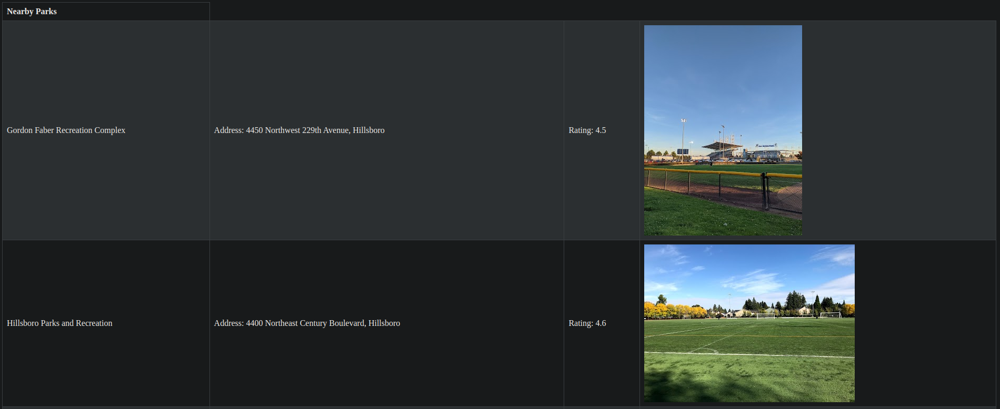

# Parks API
Park API that pulls nearby parks from Google Places API

## Features
- Docker-compose dev environment that updates upon changes
- Returns nearby parks data from a postal zipcode including:

  - Park name
  - Address
  - Rating
  - Picture
- Connected to [main app](https://github.com/Ramsey2022/day_planner) and database via Docker network

# Demo
